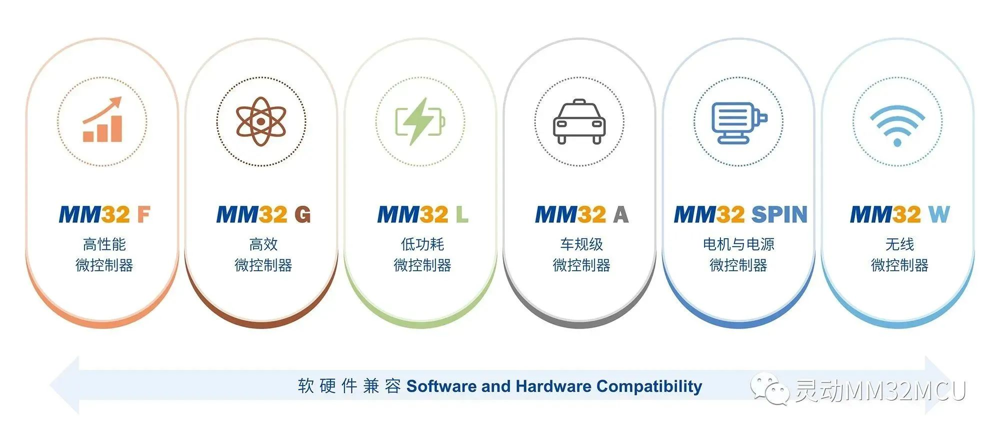
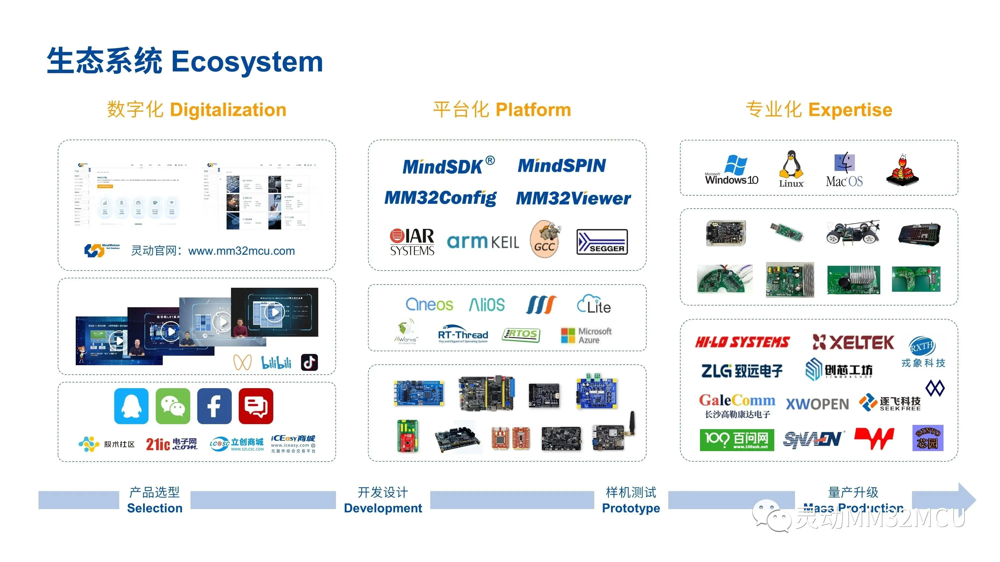

#项目简介

在这里您可以获取灵动微电子生态相关的所有资料，包括但是不限于开发板、固件库、UM、DS、Pack包、开发工具以及一些应用笔记。您的开发过程可能需要的资料这里都有准备，您可以按左侧的导航条按需下载，也可以按“Next”或者“Previous”按钮来浏览整个资料内容。

#关于灵动
上海灵动微电子股份有限公司成立于 2011 年，是中国本土领先的通用 32 位 MCU 产品及解决方案供应商。公司基于 Arm Cortex-M 系列内核开发的 MM32 MCU 产品拥有 F/G/L/A/SPIN/W 六大系列，目前已量产近 300 款型号，累计交付超 5 亿颗，每年都有近亿台配备了灵动 MM32MCU 的优秀产品交付到客户手中，在本土通用 32 位 MCU 公司中位居前列。

灵动客户涵盖智能工业、汽车电子、通信基建、医疗健康、智慧家电、物联网、个人设备、手机和电脑等应用领域。灵动是中国为数不多的同时获得了 Arm-KEIL、IAR、SEGGER 官方支持的本土 MCU 公司，并建立了独立、完整的通用 MCU 生态体系。灵动始终秉承着“诚信、承诺、创新、合作”的精神，为客户提供从硬件芯片到软件算法、从参考方案到系统设计的全方位支持。
