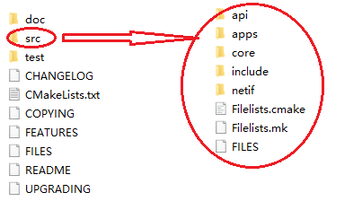
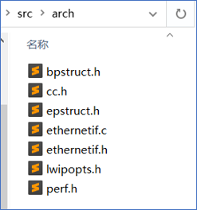
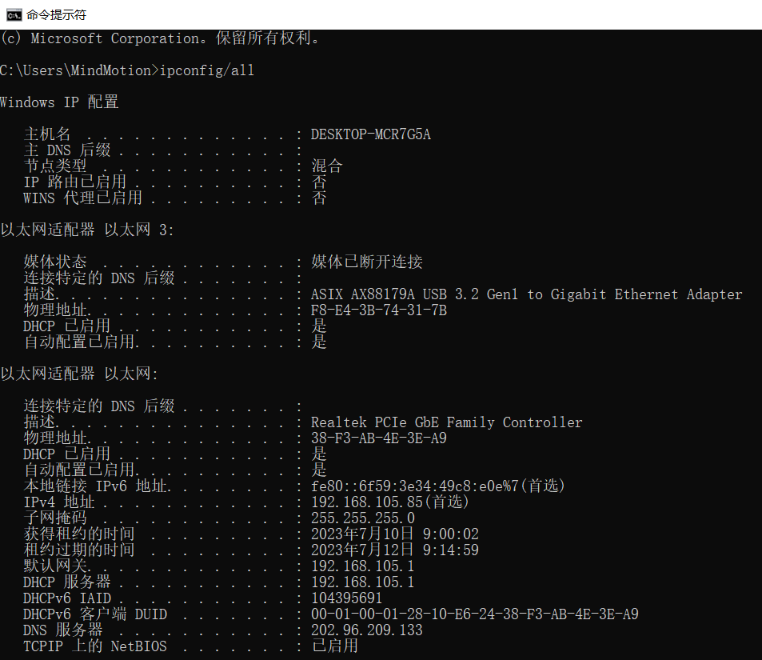
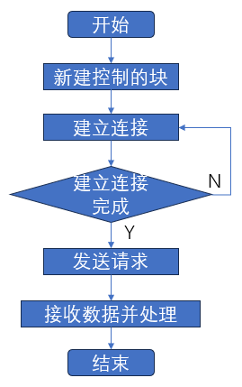
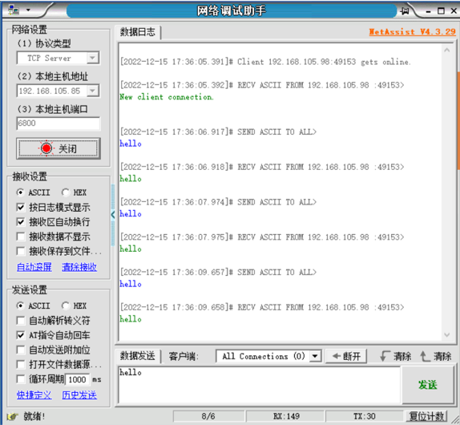
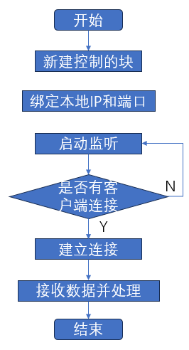
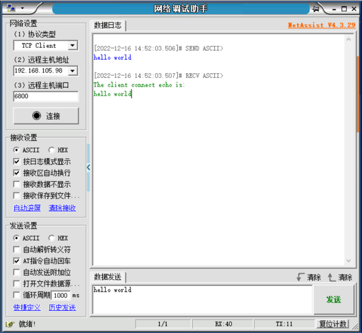
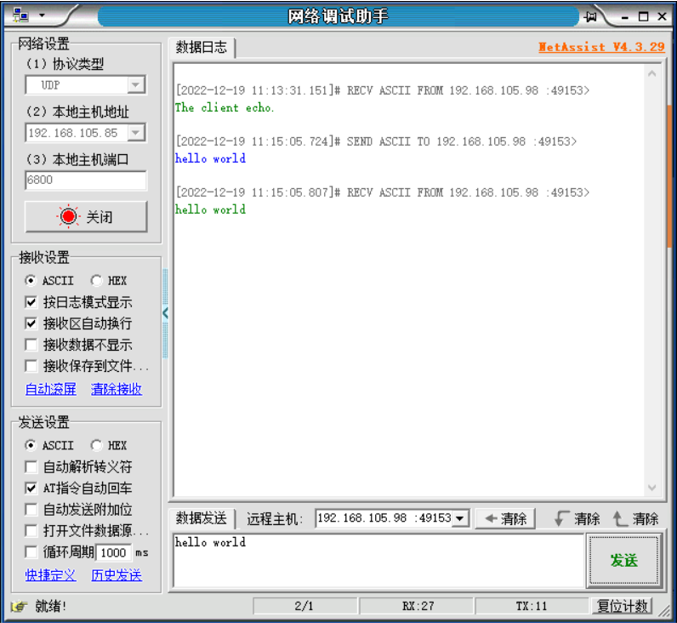
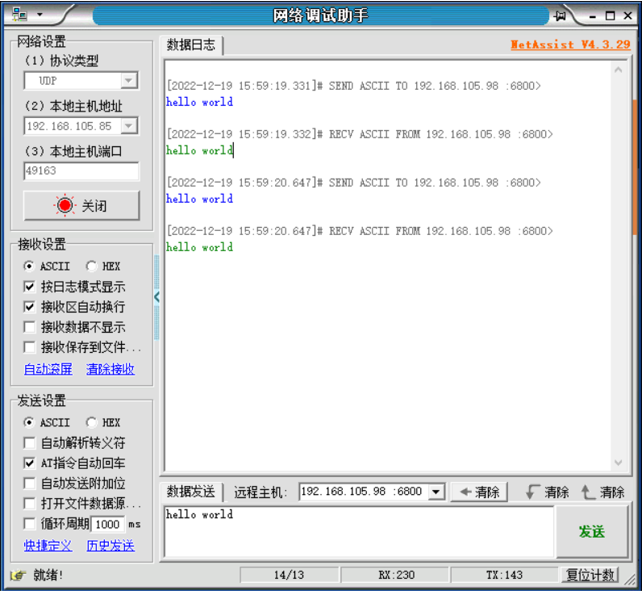

# LwIP协议栈移植笔记

[TOC]

## LwIP简介

LwIP是轻量化的TCP/IP协议，由瑞典计算机科学院(SICS)的Adam Dunkels 开发的一个小型开源的TCP/IP协议栈。LwIP具有高度可移植性、代码开源，提供了三种编程接口（API）：RAW API、NETCONN API 和 Socket API，用于与TCP/IP代码进行通信。

通过官网（http://savannah.nongnu.org/projects/lwip/）可获取LwIP源码包及contrib包。源代码包主要包含LwIP内核的源码文件，contrib包中包含部分移植和应用LwIP的demo。contrib包不属于LwIP内核的一部分，但很有参考价值。

以lwip-2.1.2版本的源码包为例，如图x所示，该源码包分为三部分，`src`文件为LWIP源代码文件，`doc`文件包含LwIP相关文档，`test`为LwIP测试文件，使用时主要关注于`src`文件下的内容。

LwIP内核是由一系列模块组合而成，包括 TCP/IP 协议栈的各种协议、内存管理、数据包管理、网卡接口、基础功能类模块、API等，构成这些模块的源文件就分布在api、apps、core、netif中，头文件则汇总在include中。

- api：NETCONN API和Socket API相关的源文件，只有在操作系统的环境中，才能被编译
- apps：应用程序的源文件，包括常见的应用程序，如httpd、mqtt、tftp、sntp、snmp等
- core：LwIP的内核源文件
- include：LwIP所有模块对应的头文件
- netif：与网卡移植有关的文件



<center> LwIP-2.1.2源码包 </center>


## 移植接口解析

LwIP使用数据结构体netif来描述网卡，并提供统一接口，需要与以太网底层驱动接口函数结合使用，例如底层驱动负责完成网卡的初始化、网卡的数据收发等，当LwIP内核需要发送一个数据包时，就会通过LWIP提供的接口函数去调用底层网卡的发送函数，将数据由硬件接口与软件内核衔接在一起。

contrib文件中包含部分可使用的网卡移植模板文件，其中ethernetif.c文件（contrib-2.1.0\examples\ethernetif目录下的ethernetif.c文件）为底层接口驱动的模板，以 LibSamples 为例，若要基于 LibSample的以太网驱动移植LwIP，则需参考ethernetif.c模板，根据以太网驱动及所需配置进行修改，将底层驱动 ethernet 相关函数填充到LwIP所需的指定功能函数中。

ethernetif.c文件中的函数通常为与硬件打交道的底层函数，当有数据需要通过网卡接收或者发送数据的时候就会被调用，经过LwIP协议栈内部进行处理后，从应用层就能得到数据或者可以发送数据。该文件中包括函数：low_level_init()、low_level_output()、low_level_input()、ethernetif_input()和ethernetif_init()函数。

- ethernetif_init()
    LwIP中默认的网卡初始化函数，内部封装了low_level_init()函数

- ethernetif_input()
    该函数用于接收网卡数据，内部封装了low_level_input()函数，在接收完毕时，将数据通过pbuf递交给上层。

- low_level_init()
    low_level_init()函数主要是根据实际情况对网卡进行一系列的初始化工作，例如：初始化MAC地址、长度， 设置最大传输包的大小，设置网卡的属性字段等功能。
    该函数中需要调用以太网底层驱动中的相关初始化函数，以 MindSDK 为例，该函数需要调用以太网底层驱动 enet_0 的 PHY、MAC、DMA相关初始化函数并进行配置。

- low_level_output()
    该函数用于实现网卡发送数据，是一个底层驱动函数，需根据以太网底层驱动进行相应修改，若想通过一个网卡发送数据，则需要将该数据传入LwIP内核中，经过层层封装最后存储在pbuf数据包中，需注意pbuf以链表的形式存在，数据发送时是以一整个数据包全部发送的。

- low_level_input()
    low_level_input()函数用于从网卡中接收一个数据包，并将该数据包封装在pbuf中递交给上层，该函数需要调用以太网底层驱动中的接收函数。

## 移植LwIP协议栈

基于LibSamples的以太网驱动对LwIP进行移植，需先将LwIP源文件中的部分文件添加到LibSamples中，如：`src`源文件、`include`头文件。
若想令LwIP运行，还需补充contrib文件中部分内容，如图x所示，由于部分源文件中使用头文件写法为”arch/xx”，因此，在src文件下新建arch文件，并将需要修改的模板文件及contrib中的部分接口文件放入arch文件中。

- ethernetif.c网卡移植模板文件
- cc.h文件主要完成协议栈内部使用的数据类型的定义
- lwipopts.h文件包含了用户对协议栈内核参数进行的配置，若未在lwipopts.h文件中进行配置，则LwIP会使用opt.h中的默认参数
- perf.h文件是实现与系通通计和测量相关的功能，若未使用该功能，则无需修改
- bpstruct.h、epstruct.h由contrib文件下的ports文件所提供，属于堆栈的一部分，无需修改



<center>图x LWIP移植所需部分文件

lwipopts.h文件中需要根据是否为操作系统模拟层、堆内存大小、是否使用TCP及TCP相关配置等进行宏定义配置，例如：宏定义`NO_SYS`表示无操作系统模拟层，因为当前为无操作系统的移植，所以设置该宏定义为1。

~~~c
...
/**
 * NO_SYS==1: Provides VERY minimal functionality. Otherwise,
 * use LwIPfacilities.
 */
#define NO_SYS                  1
...
~~~

cc.h文件中包含处理器相关的变量类型、数据结构及字节对齐的相关宏，需根据处理器及编译器进行修改。

~~~c
...
#define LWIP_NO_STDINT_H  1

typedef unsigned   char    u8_t;
typedef signed     char    s8_t;
typedef unsigned   short   u16_t;
typedef signed     short   s16_t;
typedef unsigned   long    u32_t;
typedef signed     long    s32_t;
typedef u32_t mem_ptr_t;
typedef int sys_prot_t;

#define U16_F "hu"
#define S16_F "d"
#define X16_F "hx"
#define U32_F "u"
#define S32_F "d"
#define X32_F "x"
#define SZT_F "uz" 
...
#elif defined (__GNUC__)

#define PACK_STRUCT_BEGIN
#define PACK_STRUCT_STRUCT __attribute__ ((__packed__))
#define PACK_STRUCT_END
#define PACK_STRUCT_FIELD(x) x
...
~~~

### low_level_init移植接口实现

头文件配置并修改完成后，需要对移植模板文件 ethernetif.c 进行修改。
在以太网底层驱动与LwIP初始化接口的衔接上，对low_level_init()进行修改，在对LwIP的netif结构体进行相关配置之前，需要通过以太网底层驱动使硬件被初始化；初始化后，配置 MAC 硬件地址，链接发送描述符及接收描述符并进行描述符内容配置，配置描述符地址，配置完成后，使能以太网 DMA 启动传输，此时，初始化完成。

```c
static void
low_level_init(struct netif *netif)
{
  struct ethernetif *ethernetif = netif->state;

  /* set MAC hardware address length */
  netif->hwaddr_len = ETHARP_HWADDR_LEN;

  /* set MAC hardware address */
  netif->hwaddr[0] = BOARD_MAC_ADDR0;
  netif->hwaddr[1] = BOARD_MAC_ADDR1;
  netif->hwaddr[2] = BOARD_MAC_ADDR2;
  netif->hwaddr[3] = BOARD_MAC_ADDR3;
  netif->hwaddr[4] = BOARD_MAC_ADDR4;
  netif->hwaddr[5] = BOARD_MAC_ADDR5;

  /* maximum transfer unit */
  netif->mtu = 1500;

  /* device capabilities */
  /* don't set NETIF_FLAG_ETHARP if this device is not an ethernet one */
  netif->flags = NETIF_FLAG_BROADCAST | NETIF_FLAG_ETHARP | NETIF_FLAG_LINK_UP;

#if LWIP_IPV6 && LWIP_IPV6_MLD
  /*
   * For hardware/netifs that implement MAC filtering.
   * All-nodes link-local is handled by default, so we must let the hardware know
   * to allow multicast packets in.
   * Should set mld_mac_filter previously. */
  if (netif->mld_mac_filter != NULL) {
    ip6_addr_t ip6_allnodes_ll;
    ip6_addr_set_allnodes_linklocal(&ip6_allnodes_ll);
    netif->mld_mac_filter(netif, &ip6_allnodes_ll, NETIF_ADD_MAC_FILTER);
  }
#endif /* LWIP_IPV6 && LWIP_IPV6_MLD */

    ETH_GPIOInit();
    SysTick->CTRL |= ((uint32_t)0x00000004);
    SysTick_Config(120000000 / 1000);

    ETH_InitTypeDef ptr;
    ETH_StructInit(&ptr);
    ptr.ETH_AutoNegotiation = ETH_AutoNegotiation_Disable;
    ETH_Init(&ptr, ENET_PHY_ADDR);
    ETH->DMAOMR &= ~ETH_DMAOMR_OSF;

    /* Enable ETH DMA interrupt. */
    ETH_DMAITConfig(ETH_DMA_IT_NIS|ETH_DMA_IT_R, ENABLE);

    NVIC_InitTypeDef        NVIC_InitStruct;
    NVIC_InitStruct.NVIC_IRQChannel = ENET_IRQn;
    NVIC_InitStruct.NVIC_IRQChannelPreemptionPriority = 0;
    NVIC_InitStruct.NVIC_IRQChannelSubPriority = 1;
    NVIC_InitStruct.NVIC_IRQChannelCmd = ENABLE;
    NVIC_Init(&NVIC_InitStruct);

    /* Config macd filter address. */
    ENET_SetupMacAddrFilter(0x1u<<31|0x1u<<5, ENET_ADDR_FILTER_NUM, 0u, netif->hwaddr);

    /* Set tx dma desp link. */
    memset(enet_txdma_desp_tbl, 0, sizeof(enet_txdma_desp_tbl));
    for (uint32_t i = 0u; i < ENET_TX_NUM - 1; i++) {
        enet_txdma_desp_tbl[0].CS |= TXDMA_DES0_TCH; /* TCH  = 1u. */
        enet_txdma_desp_tbl[0].BUF1ADDR = (uint32_t)(enet_txbuf[i]);
        enet_txdma_desp_tbl[0].BUF2NDADDR = (uint32_t)(&enet_txdma_desp_tbl[i + 1]);
    }
    enet_txdma_desp_tbl[0].CS |= TXDMA_DES0_TCH; /* TCH  = 1u. */
    enet_txdma_desp_tbl[0].BUF1ADDR = (uint32_t)(enet_txbuf[ENET_TX_NUM - 1]);
    enet_txdma_desp_tbl[0].BUF2NDADDR = (uint32_t)(&enet_txdma_desp_tbl[0]);

    /* Set enet tx dma descriptor first address. */
    ETH->DMATXDSAR = (uint32_t)(&enet_txdma_desp_tbl[0]);
    enet_usable_txdma_desp = &enet_txdma_desp_tbl[0];

    /* Set rx dma desp link. */
    memset(enet_rxdma_desp_tbl, 0, sizeof(enet_rxdma_desp_tbl));
    for (uint32_t i = 0; i < ENET_RX_NUM - 1; i++) {
        enet_rxdma_desp_tbl[i].CS |= RXDMA_DES0_OWN; /* RDES0[OWN]  = 1. */
        enet_rxdma_desp_tbl[i].BL |= RXDMA_DES1_RCH; /* RDES1[RCH] = 1. */
        enet_rxdma_desp_tbl[i].BL &= ~ RXDMA_DES1_RBS1;
        enet_rxdma_desp_tbl[i].BL |= ENET_RX_BUFLEN; /* RDES1[RBS1] = ENET_RX_BUFLEN. */
        enet_rxdma_desp_tbl[i].BUF1ADDR = (uint32_t)enet_rxbuf[i];
        enet_rxdma_desp_tbl[i].BUF2NDADDR = (uint32_t)(&enet_rxdma_desp_tbl[i+1]);
    }
    enet_rxdma_desp_tbl[ENET_RX_NUM - 1].CS |= RXDMA_DES0_OWN; /* RDES0[OWN]  = 1. */
    enet_rxdma_desp_tbl[ENET_RX_NUM - 1].BL |= RXDMA_DES1_RCH; /* RDES1[RCH] = 1. */
    enet_rxdma_desp_tbl[ENET_RX_NUM - 1].BL &= ~ RXDMA_DES1_RBS1;
    enet_rxdma_desp_tbl[ENET_RX_NUM - 1].BL |= ENET_RX_BUFLEN; /* RDES1[RBS1] = ENET_RX_BUFLEN. */
    enet_rxdma_desp_tbl[ENET_RX_NUM - 1].BUF1ADDR = (uint32_t)enet_rxbuf[ENET_RX_NUM - 1];
    enet_rxdma_desp_tbl[ENET_RX_NUM - 1].BUF2NDADDR = (uint32_t)(&enet_rxdma_desp_tbl[0]);

    ETH->DMARXDSAR = (uint32_t)enet_rxdma_desp_tbl;
    enet_first_rxdma_desp = &enet_rxdma_desp_tbl[0];

    ETH_Start();
}
```

### low_level_output移植接口实现

low_level_output()函数与以太网底层驱动的发送功能函数相结合，将LwIP要发送的数据存储到以太网发送描述符中所指定的存储区域中，再对发送描述符进行配置并进行发送。

```c
static err_t
low_level_output(struct netif *netif, struct pbuf *p)
{
  struct ethernetif *ethernetif = netif->state;
  struct pbuf *q;

  /* Get current destination address. */
  ETH_DMADESCTypeDef * txdma_desp = enet_usable_txdma_desp;

  if (0u != (txdma_desp->CS & TXDMA_DES0_OWN) ){
    return ERR_USE;
  }

#if ETH_PAD_SIZE
  pbuf_remove_header(p, ETH_PAD_SIZE); /* drop the padding word */
#endif

  uint32_t e_offset = 0; /* record enet module buf offset. */
  for (q = p; q != NULL; q = q->next) {
    /* Send the data from the pbuf to the interface, one pbuf at a
       time. The size of the data in each pbuf is kept in the ->len
       variable. */
    for (uint32_t i = 0; i < q->len; i++) {
      ((uint8_t*)(txdma_desp->BUF1ADDR))[e_offset] = ((uint8_t*)(q->payload))[i];
      e_offset++;
      if (e_offset == ENET_TX_BUFLEN) {
        txdma_desp = (ETH_DMADESCTypeDef*)(txdma_desp->BUF2NDADDR);
        if ((txdma_desp->CS & TXDMA_DES0_OWN) != 0u) {
          return ERR_USE;
        }
        e_offset = 0;
      }
    }
  }

  if (p->tot_len <= ENET_TX_BUFLEN) {
    enet_usable_txdma_desp->CS |= TXDMA_DES0_TFS | TXDMA_DES0_TLS | TXDMA_DES0_OWN;
    enet_usable_txdma_desp->BL &= ~0x1FFF;
    enet_usable_txdma_desp->BL |= p->tot_len; /* TBS1!< Transfer buffer size 1. */
    enet_usable_txdma_desp = (ETH_DMADESCTypeDef*)enet_usable_txdma_desp->BUF2NDADDR;
  } else {
    enet_usable_txdma_desp->CS |= TXDMA_DES0_TFS; /* TFS = 1u. */
    enet_usable_txdma_desp->CS &= ~TXDMA_DES0_TLS; /* TLS = 0u. */
    enet_usable_txdma_desp->BL &= ~0x1FFF;
    enet_usable_txdma_desp->BL |= ENET_TX_BUFLEN; /*!< Transfer buffer size 1. */
    enet_usable_txdma_desp = (ETH_DMADESCTypeDef*)enet_usable_txdma_desp->BUF2NDADDR;
    for (uint32_t i = ENET_TX_BUFLEN; i < p->tot_len - ENET_TX_BUFLEN; i+= ENET_TX_BUFLEN) {
      enet_usable_txdma_desp->CS &= ~TXDMA_DES0_TFS; /* TFS = 0u. */
      enet_usable_txdma_desp->CS &= ~TXDMA_DES0_TLS; /* TLS = 0u. */
      enet_usable_txdma_desp->BL &= ~0x1FFF;
      enet_usable_txdma_desp->BL |= ENET_TX_BUFLEN;
      enet_usable_txdma_desp = (ETH_DMADESCTypeDef*)enet_usable_txdma_desp->BUF2NDADDR;
    }
    enet_usable_txdma_desp = (ETH_DMADESCTypeDef*)enet_usable_txdma_desp->BUF2NDADDR;
    enet_usable_txdma_desp->CS &= ~TXDMA_DES0_TFS; /* TFS = 0u. */
    enet_usable_txdma_desp->CS |= TXDMA_DES0_TLS;  /* TLS = 1u. */
    enet_usable_txdma_desp->BL &= ~0x1FFF;
    enet_usable_txdma_desp->BL |= (p->tot_len % ENET_TX_BUFLEN);
  }

  if (0 != (ETH->DMASR &ETH_DMA_TransmitProcess_Suspended)){
    ETH_ResumeDMATransmission();
  }

  MIB2_STATS_NETIF_ADD(netif, ifoutoctets, p->tot_len);
  if (((u8_t *)p->payload)[0] & 1) {
    /* broadcast or multicast packet*/
    MIB2_STATS_NETIF_INC(netif, ifoutnucastpkts);
  } else {
    /* unicast packet */
    MIB2_STATS_NETIF_INC(netif, ifoutucastpkts);
  }
  /* increase ifoutdiscards or ifouterrors on error */

#if ETH_PAD_SIZE
  pbuf_add_header(p, ETH_PAD_SIZE); /* reclaim the padding word */
#endif

  LINK_STATS_INC(link.xmit);

  return ERR_OK;
}
```

### low_level_input移植接口实现

low_level_input()函数与以太网底层驱动的接收功能函数相结合，将接收到的数据存入LwIP的pbuf链中。ethernetif_input()函数调用low_level_input()函数。

```c
static struct pbuf *
low_level_input(struct netif *netif)
{
  struct ethernetif *ethernetif = netif->state;
  struct pbuf *p, *q;
  u16_t len;

  ETH_DMADESCTypeDef * rxdma_desp = enet_first_rxdma_desp;
  for (uint32_t i = 0; i < ENET_RX_NUM; i++) {
    if ((rxdma_desp->CS & RXDMA_DES0_RLS) != 0) {
        len = (uint32_t)(rxdma_desp->CS & RXDMA_DES0_FL)>>16;
        break;
    } else if ((rxdma_desp->CS & RXDMA_DES0_OWN) != 0) {
      return NULL;
    } else {
      rxdma_desp = (ETH_DMADESCTypeDef*)(rxdma_desp->BUF2NDADDR);
    }
  }

#if ETH_PAD_SIZE
  len += ETH_PAD_SIZE; /* allow room for Ethernet padding */
#endif

  /* We allocate a pbuf chain of pbufs from the pool. */
  p = pbuf_alloc(PBUF_RAW, len, PBUF_POOL);

  if (p != NULL) {

#if ETH_PAD_SIZE
    pbuf_remove_header(p, ETH_PAD_SIZE); /* drop the padding word */
#endif

    /* We iterate over the pbuf chain until we have read the entire
     * packet into the pbuf. */
    uint32_t e_offset = 0;
    rxdma_desp = enet_first_rxdma_desp;
    for (q = p; q != NULL; q = q->next) {
      /* Read enough bytes to fill this pbuf in the chain. The
       * available data in the pbuf is given by the q->len
       * variable.
       * This does not necessarily have to be a memcpy, you can also preallocate
       * pbufs for a DMA-enabled MAC and after receiving truncate it to the
       * actually received size. In this case, ensure the tot_len member of the
       * pbuf is the sum of the chained pbuf len members.
       */
      for (uint32_t i = 0; i < q->len; i++) {
        ((uint8_t*)q->payload)[i] = ((uint8_t*)rxdma_desp->BUF1ADDR)[e_offset];
        e_offset++;
        if (e_offset == ENET_RX_BUFLEN) {
          rxdma_desp = (ETH_DMADESCTypeDef*)(rxdma_desp->BUF2NDADDR);
          e_offset = 0;
        }
      }
    }

    MIB2_STATS_NETIF_ADD(netif, ifinoctets, p->tot_len);
    if (((u8_t *)p->payload)[0] & 1) {
      /* broadcast or multicast packet*/
      MIB2_STATS_NETIF_INC(netif, ifinnucastpkts);
    } else {
      /* unicast packet*/
      MIB2_STATS_NETIF_INC(netif, ifinucastpkts);
    }
#if ETH_PAD_SIZE
    pbuf_add_header(p, ETH_PAD_SIZE); /* reclaim the padding word */
#endif

    LINK_STATS_INC(link.recv);
  } else {
    LINK_STATS_INC(link.memerr);
    LINK_STATS_INC(link.drop);
    MIB2_STATS_NETIF_INC(netif, ifindiscards);
  }

  do {
    enet_first_rxdma_desp->CS |= RXDMA_DES0_OWN; /* Set OWN bit. */
    enet_first_rxdma_desp = (ETH_DMADESCTypeDef*)enet_first_rxdma_desp->BUF2NDADDR;
  } while ((enet_first_rxdma_desp->CS&RXDMA_DES0_OWN) == 0);

  if (RESET != (ETH_GetDMAFlagStatus((0x4 << 17)) ) ){ /*!< ENET dma rx fifo not active, need to be weak up. */
      ETH_ResumeDMAReception(); /* Wakeup enet dma receive. */
  }

  return p;
}
```

### ENET_IRQHandler中断服务函数实现

```c
/* ENET IRQHandler. */
void ENET_IRQHandler()
{
  if (0 != ETH_GetDMAFlagStatus(ETH_DMA_FLAG_R))
  {
      ethernetif_input(gnetif);
      ETH_DMAClearFlag(ETH_DMA_FLAG_R);
  }
}
```

### platform参数及函数实现

platform.h 文件中需要根据实际选用的开发板和运行参数等进行宏定义配置，如 IP 地址、端口号、MAC地址需要根据实际的网络环境进行配置。

```c
/* initialization enet. */
#define ENET_PHY_ADDR               0x00      /* Select PHY address. */
#define ENET_PHY_CONTROLREG         0u        /* PHY control register address. */
#define ENET_PHY_STATUSREG          1u        /* PHY status register sddress. */
#define ENET_PHY_RESET              0x8000    /* Set PHY reset, use in ENET_PHY_CR registers */
#define ENET_PHY_SPEED100M          0x2000    /* Set PHY speed. */
#define ENET_PHY_FULLDUPLEX         0x0100    /* Set PHY duplex mode about full duplex. */
#define ENET_PHY_LINK               0x0004    /* PHY link-up. */
#define ENET_PHY_UNIDIRECTIONAL     0x0080    /* PHY has the ability to encode and transmit data from PHY through MII interface, regardless of whether PHY has determined that an effective link has been connected and established. */
#define ENET_PHY_AUTONEGOTIATION    0x1000    /* PHY auto negotiation. */
#define ENET_TX_BUFLEN              1518u     /* Tx buffer length. */
#define ENET_TX_NUM                 5u        /* The number of tx. */
#define ENET_RX_BUFLEN              1518u     /* Configure the frame length of a received frame. */
#define ENET_RX_NUM                 5u        /* The configured number of received descriptor that can be used for receiving. */
#define ENET_ADDR_FILTER_NUM        1u         /* Select MAC address filter number from 0~5. */

#define BOARD_MAC_ADDR0             2u
#define BOARD_MAC_ADDR1             0u
#define BOARD_MAC_ADDR2             0u
#define BOARD_MAC_ADDR3             0u
#define BOARD_MAC_ADDR4             0u
#define BOARD_MAC_ADDR5             0u

#define BOARD_IP_ADDR0              169u
#define BOARD_IP_ADDR1              254u
#define BOARD_IP_ADDR2              102u
#define BOARD_IP_ADDR3              101u

#define BOARD_NETMASK_ADDR0         255u
#define BOARD_NETMASK_ADDR1         255u
#define BOARD_NETMASK_ADDR2         255u
#define BOARD_NETMASK_ADDR3         0u

#define BOARD_GW_ADDR0              192u
#define BOARD_GW_ADDR1              168u
#define BOARD_GW_ADDR2              1u
#define BOARD_GW_ADDR3              1u

#define BOARD_UDP_OWN_PORT          6800u

#define TXDMA_DES0_TCH              0x01u<<20
#define TXDMA_DES0_TFS              0x01u<<28
#define TXDMA_DES0_TLS              0x01u<<29
#define TXDMA_DES0_OWN              0x01u<<31

#define RXDMA_DES0_RLS              0x01u<<8
#define RXDMA_DES0_FL               0x3FFFu<<16
#define RXDMA_DES0_OWN              0x01u<<31
#define RXDMA_DES1_RCH              0x01u<<14
#define RXDMA_DES1_RBS1             0x1FFFu

EXTERN volatile uint32_t systime_ms;
```

platform.c文件中除了对Ethernet相关的时钟引脚进行配置及使用到的系统时钟对应参数申明外，也根据LwIP协议栈实际的应用需求，实现了关于MAC地址过滤器的函数。

```c
void ENET_SetupMacAddrFilter(uint32_t filter, uint32_t addr_id, uint32_t addr_mask, uint8_t * addr)
{
    ETH->MACAFR |= filter;
    
    if ( (0u != (filter & ETH_SourceAddrFilter_Normal_Enable)) || (0u != (filter & 0x100)) ) /* Set source address filter. */
    {
        ETH->MACA0HR = ( 0x1u<<31 | 0x1u<<30 | (uint32_t)addr[4u] | ((uint32_t)addr[5u]<<8u) );;
        ETH->MACA0LR = ( (uint32_t)addr[0u] | ((uint32_t)addr[1u] << 8u) | ((uint32_t)addr[2u] << 16u) | ((uint32_t)addr[3u] << 24u) );;
    }
    else if ( (0u != (filter & 0x10)) || (0u != (filter & 0x100))  ) /* Set destination address filter. */
    {
        ETH->MACAFR &= ~(0x1u<<4 | 0x1u<<1);
    }

    if (0u != addr_mask)
    {
        ETH->MACA0HR|= addr_mask;
    }
}
```

```c
/* Returns the current time in milliseconds, this API from lwip/sys.h */
uint32_t sys_now(void)
{
    return systime_ms;
}

uint32_t sys_jiffies(void)
{
  return systime_ms * 1000000;
}
```


## 样例说明

基于移植的 LwIP协议，LibSamples还提供了展示 LwIP中部分协议功能的样例工程，以 PLUS-F5270 V2.0 开发板为例，展示 TCP 协议客户端与服务器通信的 lwip_tcp_client、lwip_tcp_server样例，展示 UDP 协议客户端与服务器通信的 lwip_udp_client、lwip_udp_server。

**样例实现环境搭建**

- 本文基于搭载了MM32F5277E9P MCU的开发板 PLUS-F5270 V2.0进行实现，使用2根网线，分别连接电脑与路由器、开发板与路由器。

- 在官网(http://free.cmsoft.cn/reslink.php?id=205)下载网络调试助手NetAssist并安装，用于后续的样例功能验证。

- 打开电脑终端(WIN+R键，输入CMD)，然后输入指令` ipconfig/all `，查看本机的以太网IP地址为`192.168.108.85`，

- 在终端中输入命令 `netstat -na` 获取本地开放端口，这里我们获取到可用端口号为 `49153` 。

### lwip_tcp_client 

lwip_tcp_client 样例用于展示基于以太网及 LwIP使用 TCP 协议作为客户端，进行客户端与服务器之间的通信。

若想使用LWIP，则需要先将协议栈初始化，并设置主机的IP地址、子网掩码、网关地址等。需注意，样例工程中所设置的IP地址需要与路由器处于同一子网，如图x所示，在命令提示符（CMD）中使用命令`ipconfig/all`可查看各IP的详细信息，例如所查出的以太网IPx4地址为192.168.108.85，则在样例工程中可设置IP地址为192.168.108.98，网关地址与子网掩码的配置需与所查出的以太网默认网关及子网掩码相同。


~~~c
void app_lwip_init(void)
{
    ip4_addr_t ipaddr;
    ip4_addr_t netmask;
    ip4_addr_t gw;
    IP4_ADDR(&ipaddr, BOARD_IP_ADDR0, BOARD_IP_ADDR1, BOARD_IP_ADDR2, BOARD_IP_ADDR3);
    IP4_ADDR(&netmask, BOARD_NETMASK_ADDR0, BOARD_NETMASK_ADDR1, BOARD_NETMASK_ADDR2, BOARD_NETMASK_ADDR3);
    IP4_ADDR(&gw, BOARD_GW_ADDR0, BOARD_GW_ADDR1, BOARD_GW_ADDR2, BOARD_GW_ADDR3);
    lwip_init();
    ...
}
~~~



<center>图x 在CMD界面通过命令查询以太网IP信息


在配置完IP地址等必要信息后，需挂载网卡，在LWIP中网卡挂载函数为 netif_add() 函数，将所配置的数据传入该函数中。

~~~c
void app_lwip_init(void)
{
    ...
    netif_add(&gnetif, &ipaddr, &netmask, &gw, NULL, &ethernetif_init, &ethernet_input);

    netif_set_default(&gnetif);

    if (netif_is_link_up(&gnetif))
    {
        netif_set_up(&gnetif);
    }
    else
    {
        netif_set_down(&gnetif);
    }
}
~~~

lwip协议栈初始化后，需要对所使用的 TCP Client（TCP客户端）进行初始化配置。在 LwIP中存在多个与 TCP 相关的函数，lwip_tcp_client 样例所使用到的函数包括：

- tcp_new()
    创建一个TCP的PCB控制块
- tcp_connect()
    连接远端主机
- tcp_err()
    控制块err字段注册的回调函数，遇到错误时被调用
- tcp_write()
    构造一个报文并放入控制块的发送缓冲队列中
- tcp_recv()
    控制块rev字段注册的回调函数，当接收到新数据是被调用
- tcp_recved()
    当程序处理完数据后调用该函数，通知内核更新接收窗口
- tcp_close()
    关闭一个TCP连接

TCP 客户端的工作流程包括：新建控制块、建立连接、发送请求与接收数据并处理。TCP客户端工作流程如图x所示。



<center>图x TCP客户端流程图


 TCP Client（TCP客户端）进行初始化配置时，通过 IP4_ADDR() 函数将目标服务器的IP写入结构体；再通过 tcp_new() 函数为TCP客户端分配一个结构，当该结构不为空时，使用 tcp_connect() 函数与目标服务器进行连接，该函数中配置目标端口和目标IP参数并调用连接完成回调函数。

~~~c
void app_tcp_client_init(void)
{
    struct tcp_pcb *tcp_client_pcb;
    ip_addr_t app_server_ip;
    /* Write the IP of the target server into a structure, which is the local connection IP address of the pc. */
    IP4_ADDR(&app_server_ip, BOARD_TCP_SERVER_IPADDR0, BOARD_TCP_SERVER_IPADDR1, BOARD_TCP_SERVER_IPADDR2, BOARD_TCP_SERVER_IPADDR3);
    /* Assign a structure to the TCP client */
    tcp_client_pcb = tcp_new();

    if (tcp_client_pcb != NULL)
    {
        /* Connect with the target server, and the parameters include the target port and the target IP. */
        tcp_connect(tcp_client_pcb, &app_server_ip, BOARD_TCP_SERVER_PORT, app_tcp_client_connected);
        /* Registered connection error handling callback function. */
        tcp_err(tcp_client_pcb, app_tcp_client_connecterror);
    }
}
~~~

在连接完成回调函数中，使用 tcp_write() 函数发送问候字符串以建立连接，并使用 tcp_recv() 函数配置接收回调函数。

~~~c
static err_t app_tcp_client_connected(void *arg, struct tcp_pcb *pcb, err_t err)
{
    /* Send a greeting string to establish a connection */
    tcp_write(pcb, clientstring, strlen(clientstring), 1u);
    /* Configure the receive callback function */
    tcp_recv(pcb, app_tcp_client_xfer);
   
    return ERR_OK;
}
~~~

在TCP客户端接收数据后的数据处理回调函数中，接收到有效数据后，通过tcp_recved()更新接收窗口，使用 tcp_write() 函数将接收到的服务器内容回显。

~~~c
static err_t app_tcp_client_xfer(void *arg, struct tcp_pcb *pcb, struct pbuf *tcp_recv_pbuf, err_t err)
{
    if (tcp_recv_pbuf != NULL)
    {
        /* Update the receiving window */
        tcp_recved(pcb, tcp_recv_pbuf->tot_len);
        tcp_write(pcb, tcp_recv_pbuf->payload, tcp_recv_pbuf->len, 1u);
        
        pbuf_free(tcp_recv_pbuf);
    }
    else if (err == ERR_OK)
    {
        tcp_close(pcb);
        app_tcp_client_init();
        return ERR_OK;
    }
    return ERR_OK;
}
~~~

lwip_tcp_client 样例的实验现象如图x所示，通过网络调试助手可查看到连接成功后，远端服务器收到客户端发送的数据，服务器向客户端发送任意数据包后，客户端回显相同数据。



<center>图x lwip_tcp_client样例实验现象


### lwip_tcp_server

lwip_tcp_server 样例用于展示基于以太网及 LwIP使用 TCP 协议作为服务器，进行客户端与服务器之间的通信。lwip_tcp_server 样例在 LwIP协议栈初始化部分及设置IP地址、子网掩码、网关地址等参数的配置，与lwip_tcp_client 样例相同。

TCP服务器的工作流程包括：新建控制块、绑定控制块、控制块监听、建立连接以及接收并处理数据，如图x所示。



<center>图x TCP 服务器工作流程


初始化 TCP Server（TCP 服务器），通过 tcp_new() 函数为TCP服务器分配一个结构体，使用 tcp_bind（） 函数绑定本地端口号及IP地址，设定端口号为`BOARD_TCP_SERVER_PORT`，IP地址为`IP_ADDR_ANY`，使用 tcp_listen() 函数监听之前创建的结构体，最后通过 tcp_accept() 函数初始化结构体接收回调函数。

~~~c
void app_tcp_server_init(void)
{
    struct tcp_pcb *pcb;
    /* Create new control block. */
    pcb = tcp_new();
    /* Binding local port and IP address. */
    tcp_bind(pcb, IP_ADDR_ANY, BOARD_TCP_SERVER_PORT);
    /* Start monitoring. */
    pcb = tcp_listen(pcb);
    /* Initialize the structure to receive the callback function. */
    tcp_accept(pcb, app_tcp_server_accept);
}
~~~

TCP服务器接收回调函数中，通过 tcp_recv() 函数注册接收回调函数，该回调函数中包含TCP服务器接收数据处理，在接收到客户端的数据后，服务器向客户端发送一段字符数据表示已接收到并将接受的数据发送回去，释放pbuf并结束此次TCP连接。

~~~c
static err_t app_tcp_server_accept(void *arg, struct tcp_pcb *pcb, err_t err)
{
    tcp_recv(pcb, app_tcp_server_receive);
    return ERR_OK;
}
/* TCP server receive processing. */
static err_t app_tcp_server_receive(void *arg, struct tcp_pcb *pcb, struct pbuf *tcp_recv_pbuf, err_t err)
{
    if (tcp_recv_pbuf != NULL)
    {
        /* Update the receiving window */
        tcp_recved(pcb, tcp_recv_pbuf->tot_len);
        tcp_write(pcb,echostring, strlen(echostring), 1u);
        /* send the receive data. */
        tcp_write(pcb, tcp_recv_pbuf->payload, tcp_recv_pbuf->len, 1u);
        pbuf_free(tcp_recv_pbuf);
        tcp_close(pcb);  /* close connect. */
    }
    else if(err == ERR_OK)
    {
        return tcp_close(pcb);
    }
    return ERR_OK;
}
~~~

lwip_tcp_server 样例的实验现象如图x所示。网络调试助手做TCP客户端，向开发板所做的服务器发送数据，服务器接收数据后发送一段字符并将该数据发回客户端。



<center>图x lwip_tcp_server实验现象


### lwip_udp_client

lwip_udp_client 样例用于展示基于以太网及 LwIP使用 UDP 协议作为客户端，进行客户端与服务器之间的通信。在 LwIP中存在多个与 UDP 相关的函数，例如：

- udp_new
    新建一个UDP的PCB块
- udp_remove
    将一个PCB控制块从链表中删除，并释放相应的内存
- udp_bind
    为UDP的PCB控制块绑定一个本地IP地址和端口号
- udp_connect
    连接到指定IP地址主机的指定端口上
- udp_disconnect
    断开连接，将控制块设置为非连续状态
- udp_send
    通过一个PCB控制块发送数据
- udp_recv
    需要创建的一个回调函数，当接收到数据的时候被调用

lwip_udp_client 样例在 LwIP协议栈初始化部分及设置IP地址、子网掩码、网关地址等参数的配置，与lwip_tcp_client 样例相同。
LWIP协议栈初始化完成后，进行 UDP 做客户端初始化，通过 IP4_ADDR() 函数设置服务端的IP地址，再由 udp_new() 函数创建一个新的UDP控制块，通过 udp_bind() 的 函数为UDP的PCB控制块绑定一个本地IP地址和端口号，设置端口号为`BOARD_UDP_OWN_PORT`。由udp_connect() 函数连接到指定IP地址主机的指定端口，端口为`BOARD_UDP_ECHO_PORT`，通过 udp_recv() 函数注册回调函数。

~~~c
void app_udp_client_init(void)
{
    ip_addr_t udp_server_addr;
    struct udp_pcb * pcb;
    IP4_ADDR(&udp_server_addr, BOARD_UDP_SERVER_IPADDR0, BOARD_UDP_SERVER_IPADDR1, BOARD_UDP_SERVER_IPADDR2, BOARD_UDP_SERVER_IPADDR3);
    pcb = udp_new(); /* Generate a new UDP control block */
    if (pcb != NULL)
    {
        udp_bind(pcb, IP_ADDR_ANY, BOARD_UDP_OWN_PORT);
        udp_connect(pcb, &udp_server_addr, BOARD_UDP_ECHO_PORT);
        udp_recv(pcb, app_udp_server_callback, NULL);  /* Receive callback. */
        app_udp_client_send(pcb, app_udp_client_data);
    }
}
~~~

UDP 做客户端先发送自定字符数据，等待收到来自服务器的数据后，将数据发回服务器。lwip_udp_client 样例实验现象如图x所示。



<center>图x lwip_udp_client实验现象


### lwip_udp_server

lwip_udp_server 样例用于展示基于以太网及 LwIP使用 UDP 协议作为服务器，进行客户端与服务器之间的通信。
lwip_udp_server 样例在 LwIP协议栈初始化部分及设置IP地址、子网掩码、网关地址等参数的配置，与lwip_udp_client 样例相同。

LWIP协议栈初始化完成后，进行 UDP 做服务器初始化，通过 udp_new() 函数生成一个新的UDP控制块，udp_bind() 函数绑定任意IP地址`IP_ADDR_ANY`及指定端口`BOARD_UDP_OWN_PORT`，通过 udp_recv() 函数注册回调函数。

~~~c
void app_udp_server_init(void)
{
    struct udp_pcb * pcb;
    pcb = udp_new(); /* Generate a new UDP control block */
    udp_bind(pcb, IP_ADDR_ANY, BOARD_UDP_OWN_PORT);   /* Bind upcb block to any IP address and specified port */
    udp_recv(pcb, app_udp_server_callback, NULL);  /* Receive callback. */
}
~~~

UDP服务器回调函数用于发送函数到客户端，通过 udp_sendto() 函数发送数据包，udp_disconnect() 函数断开链接。

~~~c
static void app_udp_server_callback(void *arg,struct udp_pcb *upcb,struct pbuf *p,const ip_addr_t *addr, u16_t port)
{
    udp_sendto(upcb, p, addr, port);  /* Send data to destination address. */
    udp_disconnect(upcb);          /* Remove the remote end of the pcb. */
}
~~~

lwip_udp_server 样例的实验现象如图x所示。



<center>图x lwip_udp_server 实验现象


## 结语

本文对LwIP协议栈进行了简单介绍，并对 TCP 协议与 UDP 协议的客户端与服务器之间的通信进行分析，最后对 LwIP的移植和样例演示操作进行了讲解。

## 注意事项

- 在配置 IP 地址和端口号时，当连接了WIFI后需要注意我们选用的是以太网的IP地址，而非WLAN的IP地址。

- lwip_tcp_server 样例演示中，在 `网络调试助手`工具中的左侧 远程主机地址 参数填写要和修改样例中的 BOARD_IP_ADDR0~3 的参数一致，且要在主机以太网所分配的局域网IP地址范围内。（BOARD_GW_ADDR0~3参数全程可不修改）

- 在裸机运行环境中，使用到了 Systick 作为时间基准，需要在 platform.c/.h 文件中进行声明和定义，以及在 mm32f5270_it.c 文件中进行中断服务函数的实现。
