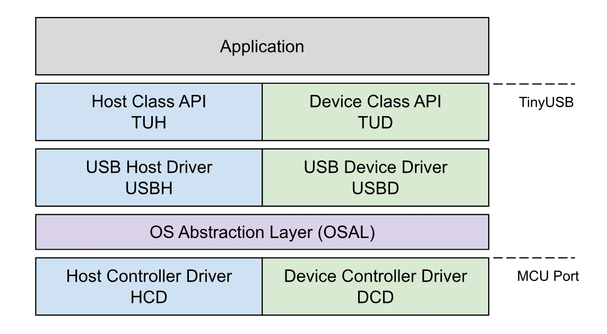
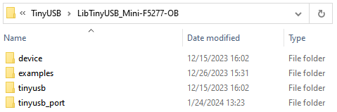
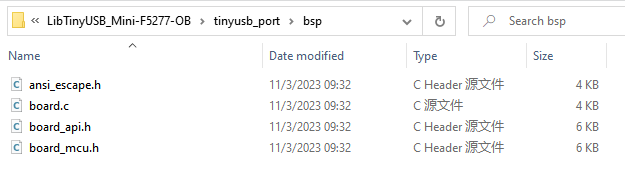
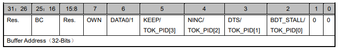
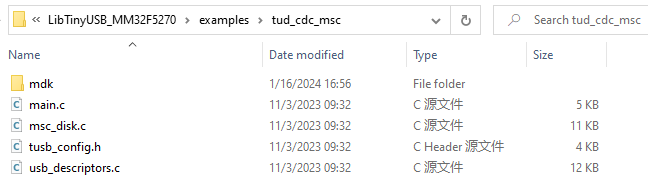
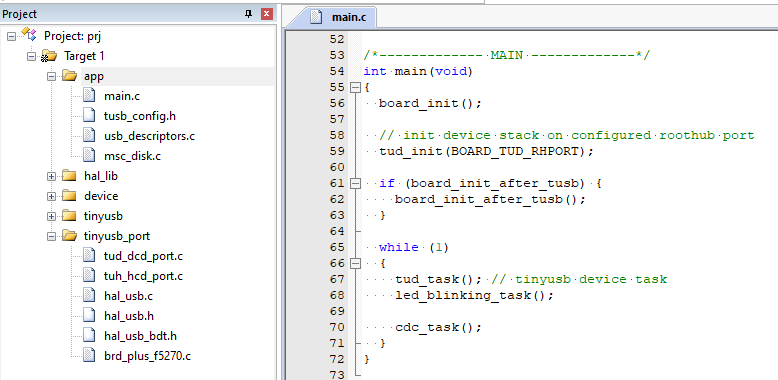
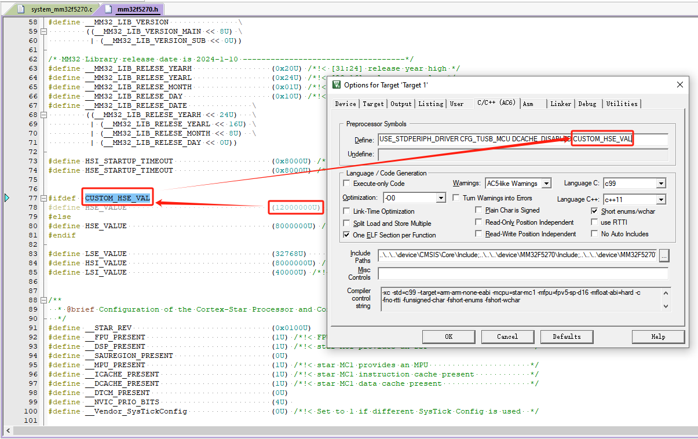
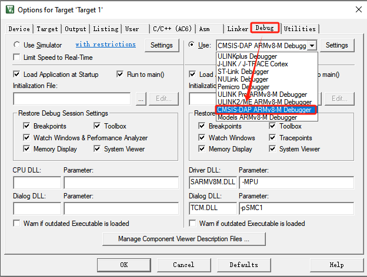

# 从零开始移植TinyUSB协议栈

[TOC]

## 简介

本文将基于 Mini-F5277-OB 开发板，讲解从零开始移植Tiny USB协议栈的全过程。

**Mini-F5277-OB 开发板介绍**

Mini-F5277-OB 开发板，搭载了MM32F5270系列中 MM32F5277E7PV 型号的MCU，为32位 Arm China STAR-MC1 架构，内置 256KB Flash，192KB SRAM，并带有USB全速设备控制器，支持 12Mbps 的传输速率。在配置为 USB Host 模式下支持 12Mbps 的全速传输和 1.5 Mbps 的低速传输速率。其中 USB_FS 控制器内置 USB 全速 PHY。详情见：[上海灵动微电子股份有限公司 (mindmotion.com.cn)](https://www.mindmotion.com.cn/support/development_tools/evaluation_boards/miniboard/mm32f5277e7pv/)官网。


**TinyUSB 协议栈介绍**

TinyUSB 是一个应用于嵌入式系统的开源跨平台 USB Host / Device 协议栈，其优点为：

- MIT 开源协议，不用担心版权问题；

- 内存安全（没有动态内存分配）；

- 线程安全（所有中断事件都会放在非中断函数中处理）。

如下图所示，为TinyUSB协议栈结构框图：



<center> 图x TinyUSB 协议栈框图 </center>

由上图可知，TinyUSB协议栈中的Host 与 Device 是相互独立的两个协议。

TinyUSB 协议栈中的 Device 协议应用较为广泛，支持的 USB 类也十分丰富：

- Audio Class 2.0 (UAC2)
- Bluetooth Host Controller Interface (BTH HCI)
- Communication Class (CDC)
- Device Firmware Update (DFU): DFU mode (WIP) and Runtinme
- Human Interface Device (HID): Generic (In & Out), Keyboard, Mouse, Gamepad etc …
- Mass Storage Class (MSC): with multiple LUNs
- Musical Instrument Digital Interface (MIDI)
- Network with RNDIS, CDC-ECM (work in progress)
- USB Test and Measurement Class (USBTMC)
- Vendor-specific class support with generic In & Out endpoints. Can be used with MS OS 2.0 compatible descriptor to load winUSB driver without INF file.
- [WebUSB](https://github.com/WICG/webusb) with vendor-specific class

而 Host 支持的类，暂时提供了两个，不过对于 MCU 的这种资源的应用而言，以下两个类足够满足大部分需求了：

- Human Interface Device (HID): Keyboard, Mouse, Generic
- Mass Storage Class (MSC)

## 获取MCU库函数与例程

Mini-F5277-OB 开发板的驱动样例及原理图位于：`https://www.mindmotion.com.cn/support/development_tools/evaluation_boards/miniboard/mm32f5277e7pv/`，下载 `MM32F5270 库函数与例程`，这里我们用到了软件包中的`device`文件夹，其中包含MCU的启动文件和驱动文件。

## 获取TinyUSB协议栈

TinyUSB协议栈源码下载地址：`https://github.com/hathach/tinyusb/releases/tag/0.16.0 `

本次移植是基于截止本文编写时最新版本的 TinyUSB V0.16.0 进行移植，这里我们用到了软件包 `tinyusb\src` 作为协议栈源码、 `tinyusb\examples` 文件夹中USB 样例代码和 `tinyusb\hw\bsp`文件夹中的支持的开发板源文件。 

```
.
├── docs            # Documentation
├── examples        # Examples with make and cmake build system
├── hw
│   ├── bsp         # Supported boards source files
│   └── mcu         # Low level mcu core & peripheral drivers
├── lib             # Sources from 3rd party such as freeRTOS, fatfs ...
├── src             # All sources files for TinyUSB stack itself.
├── test            # Tests: unit test, fuzzing, hardware test
└── tools           # Files used internally
```

##  工程目录结构

如下图x所示，整个TinyUSB协议栈适配工程的建立分为以下四个部分：

- device - MCU启动文件及外设驱动
- examples - TinyUSB协议栈样例
- tinyusb - TinyUSB协议栈源码
- tinyusb_port - TinyUSB协议栈移植接口及USB驱动




<center> 图x </center>

除了将上述提到的 `MM32F5270 库函数与例程`软件包中的`device`文件夹和`TinyUSB V0.16.0 `软件包 中`tinyusb\src` 文件夹拷贝到目标工程文件夹中外，要新建`examples`文件夹和`tinyusb_port`文件夹。在获取的TinyUSB协议栈的 examples 文件夹中，找到目标样例。接下来本文将以 `tinyusb\exmaples\device`文件夹中的`cdc_msc`样例为例进行移植演示。

## 配置移植接口

TinyUSB 协议栈的移植接口分为 USB Device接口和 USB Host接口，这里统一在目标工程文件夹的`tinyusb_port`文件夹中进行实现，如图x所示。


<center> 图x </center>

其中`bsp`文件夹中，放置了TinyUSB协议栈中`tinyusb\hw\bsp`文件夹下的`ansi_escape.h`、`board.c` 、`board_api.h` 和`board_mcu.h` 文件，如图x所示。



<center> 图x </center>

`hal_usb.c`、`hal_usb.h` 、`hal_usb_bdt.h`和`reg_usb.h`文件为 USB驱动相关文件，若MCU中的 USB IP一致则可复用该USB 驱动文件。

`tud_dcd_port.c` 和 `tuh_hcd_port.c`是基于 USB 驱动实现的TinyUSB协议栈中USB Device移植接口和USB Host移植接口 。

`mini_f5277_ob.c`文件实现了板载MCU的USB相关的时钟配置、UART初始化、printf 函数重映射和板载LED和按键的GPIO初始化，此文件可以根据不同的开发版和MCU型号进行实现。

```c
#include "bsp/board_api.h"
#include "mm32_device.h"
#include "mm32f5270.h"

// Initialize on-board peripherals : led, button, uart and USB
void board_init(void)
{
  // Config PLL2 clock param.
  RCC_PLL2Config(1, 0, 7, 1); // PLL2 = HSE * (7+1) / (1+1) = 48MHz
  RCC->PLL2CFGR |= 3 << RCC_PLL2CFGR_PLL2_ICTRL_Pos; 

  // Enable PLL2 clock.
  RCC_PLL2Cmd(ENABLE);
  while((RCC->CR & RCC_CR_PLL2RDY_Msk) == 0)
  {
  }

  // Select PLL2 as USB clock source.
  MODIFY_REG(RCC->CFGR, RCC_CFGR_USBCLKSEL_Msk, 1 << RCC_CFGR_USBCLKSEL_Pos);

  // Enable USB Clock.
  MODIFY_REG(RCC->CFGR, RCC_CFGR_USBPRE_Msk, 0 << RCC_CFGR_USBPRE_Pos);

  // Select HSE as system clock.
  RCC_SYSCLKConfig(2);

  // clock init.
  RCC_AHBPeriphClockCmd(RCC_AHBPeriph_GPIOA, ENABLE);
  RCC_AHBPeriphClockCmd(RCC_AHBPeriph_GPIOB, ENABLE);
  RCC_AHBPeriphClockCmd(RCC_AHBPeriph_GPIOC, ENABLE);
  RCC_APB1PeriphClockCmd(RCC_APB1Periph_UART2, ENABLE);

  // sys time init;
  #if CFG_TUSB_OS == OPT_OS_NONE
    RCC_ClocksTypeDef sys_clk;
    RCC_GetClocksFreq(&sys_clk);
    SysTick_Config(sys_clk.SYSCLK_Frequency / 1000);
    NVIC_SetPriority(SysTick_IRQn, 0);
  #endif

  // peripheral init;
  GPIO_InitTypeDef gpio_init;

  // led PB15-LED1,PB14-LED2
  gpio_init.GPIO_Mode = GPIO_Mode_Out_PP;
  gpio_init.GPIO_Speed = GPIO_Speed_High;
  gpio_init.GPIO_Pin = GPIO_Pin_15;
  GPIO_Init(GPIOB, &gpio_init);
  gpio_init.GPIO_Pin = GPIO_Pin_14;
  GPIO_Init(GPIOB, &gpio_init);

  // btn PB0-K1,PB1-K2
  gpio_init.GPIO_Mode = GPIO_Mode_IPU;
  gpio_init.GPIO_Pin = GPIO_Pin_0;
  GPIO_Init(GPIOB, &gpio_init);
  gpio_init.GPIO_Pin = GPIO_Pin_1;
  GPIO_Init(GPIOB, &gpio_init);

  // uart PA2-TX,PA3-RX
  gpio_init.GPIO_Mode = GPIO_Mode_AF_PP;
  gpio_init.GPIO_Pin = GPIO_Pin_2;
  GPIO_PinAFConfig(GPIOA, GPIO_PinSource2, GPIO_AF_7);
  GPIO_Init(GPIOA, &gpio_init);

  gpio_init.GPIO_Mode = GPIO_Mode_IPU;
  gpio_init.GPIO_Pin = GPIO_Pin_3;
  GPIO_PinAFConfig(GPIOA, GPIO_PinSource3, GPIO_AF_7);
  GPIO_Init(GPIOA, &gpio_init);

  UART_InitTypeDef UART_InitStruct;
  UART_StructInit(&UART_InitStruct);
  UART_InitStruct.BaudRate      = CFG_BOARD_UART_BAUDRATE;
  UART_InitStruct.WordLength    = UART_WordLength_8b;
  UART_InitStruct.StopBits      = UART_StopBits_1;
  UART_InitStruct.Parity        = UART_Parity_No;
  UART_InitStruct.HWFlowControl = UART_HWFlowControl_None;
  UART_InitStruct.Mode          = UART_Mode_Tx | UART_Mode_Rx;
  UART_Init(UART2, &UART_InitStruct);

  UART_Cmd(UART2, ENABLE);

  RCC_AHBPeriphClockCmd(RCC_AHBPeriph_USB_FS, ENABLE);
}

// Turn LED on or off
void board_led_write(bool state)
{
  if (state)
  {
    GPIOB->BRR = 1 << 14;
    GPIOB->BRR = 1 << 15;
  }
  else
  {
    GPIOB->BSRR = 1 << 14;
    GPIOB->BSRR = 1 << 15;
  };
}

// Control led pattern using phase duration in ms.
// For each phase, LED is toggle then repeated, board_led_task() is required to be called
//void board_led_pattern(uint32_t const phase_ms[], uint8_t count);

// Get the current state of button
// a '1' means active (pressed), a '0' means inactive.
uint32_t board_button_read(void)
{
  if (!(GPIOB->IDR & (1 << 0)) | !(GPIOB->IDR & (1 << 1)) )
  {
    return 1;
  }
  else
  {
    return 0;
  }
}

// Get characters from UART. Return number of read bytes
int board_uart_read(uint8_t *buf, int len)
{
  if (UART2->CSR & UART_CSR_RXAVL_Msk)
  {
    buf[0] = UART2->RDR;
    return 1;
  }
  else
  {
    return 0;
  }
}

// Send characters to UART. Return number of sent bytes
int board_uart_write(void const *buf, int len)
{
  for (int i = 0; i < len; i++)
  {
    putchar(((char*)(buf))[i]);
  }
  return len;
}

#if CFG_TUSB_OS == OPT_OS_NONE
volatile static uint32_t systime = 0;
// Get current milliseconds, must be implemented when no RTOS is used
uint32_t board_millis(void)
{
  return systime;
}

void SysTick_Handler(void)
{
  systime++;
}
#endif

// stdio getchar() is blocking, this is non-blocking version
int board_getchar(void)
{
  if (UART2->CSR & UART_CSR_RXAVL_Msk)
  {
    return UART2->RDR;
  }
  else
  {
    return 0;
  }
}

int fputc(int ch, FILE *f)
{
  UART2->TDR = ch;

  while (UART2->CSR & UART_CSR_TXFULL_Msk)
  {}

  return (ch);
}

int fgetc(FILE* file)
{
  int ch;

  while((ch = board_getchar()) != 0)
  {}

  return ch;
}
```

需要注意的是提供过给 USB 模块的这个 48MHz 时钟可以来自于PLL1 的 N 分频，PLL2 的 N 分频，部分 MCU 可能还有其他的选择。这个 48MHz 时钟需要尽可能精确，如有必要，向 MCU 提供时钟的外部晶振都可以换成 `12.000MHz` （注意小数点后面有3个0）的晶振，以保证 48MHz 足够精确。

### 配置USB Device接口

USB Device移植接口在`tud_dcd_port.c`文件中实现，主要分为如下部分：

- SETUP 包的接收
- 设置地址
- 接口适配
- 中断处理

定义全局变量

为了适配 TinyUSB Device，在适配层一共设置如下全局变量：

```
/* OTG_FS BufferDescriptorTable Buffer. */
static __ALIGNED(512u) USB_BufDespTable_Type usb_bd_tbl = {0u}; /*usb_bufdesp_table */
static uint8_t usb_ep0_buf[CFG_TUD_ENDPOINT0_SIZE] = {0u}; /*usb_recv_buff. */
static uint8_t usb_setup_buf[8u] = {0u}; /* usb_setup_buff. */
static uint8_t usb_device_addr = 0u; /* usb_device_addr. */
typedef struct
{
    uint8_t * xfer_buf;
    uint32_t max_packet_size; /* EndPoint max packet size. */
    uint32_t length; /* EndPoint xfer data length. */
    uint32_t remaining; /* EndPoint xfer data remaining. */
    bool odd_even; /* EndPoint BD OddEven status. */
    bool data_n; /* next packet is DATA0 or DATA1. */
    bool xfer_done;
} USB_EndPointManage_Type;
static USB_EndPointManage_Type usb_epmng_tbl[16u][2u] = {0u}; /* EndPointManage Table. */
```

在`tud_dcd_port.c` 文件中定义USB 数据缓冲区（在USB驱动中定义USB_BufDespTable_Type结构体类型），并在USB驱动初始化和USB协议栈任务处理时使用。

```
static __ALIGNED(512u) USB_BufDespTable_Type usb_bd_tbl = {0u}; /* usb_bufdesp_table */
```

#### USB 端点管理

在`tud_dcd_port.c`文件中定义`USB_EndPointManage_Type`结构体类型。

```c
typedef struct
{
    uint8_t * xfer_buf;
    uint32_t max_packet_size;   /* EndPoint max packet size. */
    uint32_t length;            /* EndPoint xfer data length. */
    uint32_t remaining;         /* EndPoint xfer data remaining. */
    bool  odd_even;          /* EndPoint BD OddEven status. */
    bool  data_n;            /* next packet is DATA0 or DATA1. */
    bool  xfer_done;
} USB_EndPointManage_Type;
```

#### USB 驱动使能

在`tud_dcd_port.c`中的`dcd_init()`函数实现。

```c
// Initialize controller to device mode
void dcd_init       (uint8_t rhport)
{
    (void) rhport;
    USB_Device_Init_Type init = {0u};
    init.BufDespTable_Addr = (uint32_t)&usb_bd_tbl;
    USB_InitDevice(BOARD_USB_PORT, &init);
    USB_Enable(BOARD_USB_PORT, true);
    NVIC_ClearPendingIRQ(BOARD_USB_IRQn);
}
```

#### USB Device 中断

在`tud_dcd_port.c`中的`dcd_int_enable()`和`dcd_int_disable()`函数实现 USB Device设备的中断开启与关闭。

```
// Enable device interrupt
void dcd_int_enable (uint8_t rhport)
{
    (void) rhport;
    USB_EnableInterrupts(BOARD_USB_PORT, USB_INT_RESET | USB_INT_TOKENDONE
                                            | USB_INT_SLEEP
                                            | USB_INT_RESUME
                                            | USB_INT_STALL
                                            | USB_INT_SOFTOK, true); /* enable interrupts*/
    NVIC_SetPriority(BOARD_USB_IRQn, 3u);
    NVIC_EnableIRQ(BOARD_USB_IRQn);
}
```

并在`tud_dcd_port.c`中的`dcd_int_handler()`函数实现 USB Device 设备的中断服务函数。

```c
// Interrupt Handler
void dcd_int_handler(uint8_t rhport)
{
    uint32_t flag = USB_GetInterruptStatus(BOARD_USB_PORT);

    if (flag & USB_INT_TOKENDONE)
    {
        USB_TokenDoneHandler(rhport);
        return;
    }

    if (flag & USB_INT_RESET)
    {
        USB_ClearInterruptStatus(BOARD_USB_PORT, USB_INT_RESET);
        USB_BusResetHandler();

        dcd_event_bus_reset(rhport, TUSB_SPEED_FULL, true);
    }

    if (flag & USB_INT_SLEEP)
    {
        USB_ClearInterruptStatus(BOARD_USB_PORT, USB_INT_SLEEP);

        dcd_event_bus_signal(rhport, DCD_EVENT_SUSPEND, true);
    }
    if (flag & USB_INT_RESUME)
    {
        USB_ClearInterruptStatus(BOARD_USB_PORT, USB_INT_RESUME);

        dcd_event_bus_signal(rhport, DCD_EVENT_RESUME, true);
    }
    if (flag & USB_INT_STALL)
    {
        USB_EnableEndPointStall(BOARD_USB_PORT, USB_EP_0, false);
        dcd_edpt_clear_stall(rhport, 0);
        USB_BufDesp_Xfer(&usb_bd_tbl.Table[0u][USB_Direction_OUT][usb_epmng_tbl[0u][USB_Direction_OUT].odd_even], 1, usb_ep0_buffer, 64);
        USB_ClearInterruptStatus(BOARD_USB_PORT, USB_INT_STALL);
    }
    if (flag & USB_INT_SOFTOK)
    {
        USB_ClearInterruptStatus(BOARD_USB_PORT, USB_INT_SOFTOK);
    }
}

/* USB IRQ. */
void BOARD_USB_IRQHandler(void)
{
    dcd_int_handler(BOARD_TUD_RHPORT);
}
```

### 配置USB Host接口

MM32G5330 USB 支持 Host 功能，TinyUSB 协议栈中也包含了 Host 部分，在适配 Host 过程中，使用到了双向队列和数据库的概念。USB Host移植接口在`tuh_dcd_port.c`文件中实现，主要分为如下步骤：

- 双向队列实现
- 数据库实现
- 接口实现
- 中断处理

#### 双向队列实现

USB 总线会像多个端点传输不同的内容，但 USB 总线只有一条，因此需要将传输任务放在一个队列中，按照队列的顺序传输数据 ；在传输过程中，可能会有分段传输，传输失败等情况，可能要将传输任务重新放在队列的头部，而不是末尾，因此，这个队列不仅能将传输任务放在队列尾部，也能将传输任务放在头部，就像堆栈那样，因此，需要实现一个双向队列。同普通的队列一样，双向队列需要一个队列buffer，以及管理队列 buffer 的字段，然后每次读写队列时，不能直接操作这个 buffer，而是只能使用给定的 push 和 pop 方法操作。实现操作如下：

**buffer 和管理字段：**

```c
/* xfer task deque node. */
typedef struct
{
......
} xfer_task_node_t;

/* xfer task deque support. */
static xfer_task_node_t xfer_task_deque[TUH_HCD_PORT_XFER_TASK_DEQUE_SIZE] ={0u}; /* xfer task deque buf. */
static uint32_t xfer_task_head = 0u; /* record deque head. */
static uint32_t xfer_task_tail = 0u; /* record deque tail. */
static uint32_t xfer_task_cnt = 0u; /* record xfer task num. */
```

**操作函数：**

从头部 pop，从尾部 push：

```c
/* get deque head node & delete the node in deque. */
bool xfer_task_pop_head(xfer_task_node_t * task)
{
    if (0u == xfer_task_cnt)
    {
        return false; /* no xfer_task. */
    }

    /* pop head: read head, head--, cnt--. */
    memcpy(task, &xfer_task_deque[xfer_task_head], sizeof(xfer_task_node_t)); /* read head. */
    if (xfer_task_head == 0u) /* head--. */
    {
        xfer_task_head = TUH_HCD_PORT_XFER_TASK_DEQUE_SIZE - 1u;
    }
    else
    {
        xfer_task_head--;
    }
    xfer_task_cnt--; /* cnt--. */

    return true;
}

/* put node in deque tail. */
bool xfer_task_push_tail(xfer_task_node_t * task)
{
    if (TUH_HCD_PORT_XFER_TASK_DEQUE_SIZE == xfer_task_cnt)
    {
        return false; /* queue full. */
    }

    /* push tail: write tail, tail--, cnt++ */

    memcpy(&xfer_task_deque[xfer_task_tail], task, sizeof(xfer_task_node_t)); /* write tail. */
    if (xfer_task_tail == 0u) /* head++. */
    {
        xfer_task_tail = TUH_HCD_PORT_XFER_TASK_DEQUE_SIZE - 1u;
    }
    else
    {
        xfer_task_tail--;
    }
    xfer_task_cnt++;/* cnt++. */

    return true;
}
```

有了上面的两个方法，这就是一个普通的单项队列，英文叫做 queue，既然是双向队列，就需要在这个基础上实现从头部 push 的功能，至于尾部 pop 由于在适配过程中没有使用，不再实现，下述为相关代码实现：

```c
/* put node in deque head. */
bool xfer_task_push_head(xfer_task_node_t * task)
{
    if (TUH_HCD_PORT_XFER_TASK_DEQUE_SIZE == xfer_task_cnt)
    {
        return false; /* queue full. */
    }

    /* push head: head++, write head, cnt++ */

    if (xfer_task_head == TUH_HCD_PORT_XFER_TASK_DEQUE_SIZE - 1u) /* head++. */
    {
        xfer_task_head = 0u;
    }
    else
    {
        xfer_task_head++;
    }
    memcpy(&xfer_task_deque[xfer_task_head], task, sizeof(xfer_task_node_t)); /* write tail. */
    xfer_task_cnt++;/* cnt++. */

    return true;
}
```

需要清空双向队列的内容时，或初始化双向队列时，可使用下列方法操作:

```c
/* reset the deque, delete all node. */
void xfer_task_reset(void)
{
    xfer_task_head = 0u;
    xfer_task_tail = 0u;
    xfer_task_cnt = 0u;
}
```

#### 数据库实现

所谓数据库，只是用于存放各设备各端点信息的地方。每次发送传输数据的时候，需要知道端点的buffer 大小等信息，所以需要在数据库中查询端点信息。需要支持inset操作，delete操作，update 操作和select操作，即增删改查：

insert 操作，指将一条数据条目插入到数据表中，该条目是数据表中原来没有的内容

delete 操作，指删除数据条目或数据表

update 操作，指将一条数据条目更新到原有的条目中，主要更新原有条目的字段内容

select 操作，根据关键字查找数据表中的条目

**buffer 和管理字段：**

```c
/* endpoint status table. */
static ep_status_t ep_tbl[TUH_HCD_PORT_MAX_EP_NUM]; /* the table that record the ep_status. */
static uint32_t ep_count = 0u; /* record the how many endpoint status in ep_tbl[]. */
```

**insert & update 操作：**

```c
/* add new or modify endpoint status. */
bool ep_set_status(ep_status_t * status)
{
    ep_status_t * ep_status = ep_get_status(status->dev_ep_addr);
    if (NULL == ep_status)
    {
        if (ep_count == TUH_HCD_PORT_MAX_EP_NUM)
        {
        	return false;
        }
        ep_status = &ep_tbl[ep_count];
        ep_count++;
    }
    memcpy(ep_status, status, sizeof(ep_status_t));
    return true;
}
```

**select 操作：**

```c
/* get endpoint status. */
ep_status_t * ep_get_status(uint32_t dev_ep_addr)
{
    ep_status_t * ep_status = NULL;
    for(uint32_t i = 0u; i < ep_count; i++)
    {
        if(dev_ep_addr == ep_tbl[i].dev_ep_addr)
        {
            ep_status = &ep_tbl[i];
            break;
        }
    }
    return ep_status;
}
```

除了上面的操作，当 USB Device 拔掉的时候，数据库需要进行复位，相当于执行 delete 操作：

```c
/* clear all endpoint status. */
void ep_reset(void)
{
	ep_count = 0u;
}
```

#### USB 缓冲描述表定义

在`tuh_dcd_port.c` 文件中定义USB 数据缓冲区（在USB驱动中定义USB_BufDespTable_Type结构体类型），在USB驱动初始化和USB协议栈任务处理时使用。
USB的配置由两部分组成：一部分是实实在在的 USB 寄存器配置，一部分是 SRAM 以 512 字节对齐的 512 字节大小的缓冲区描述表。

那么如何得到一块 512 Bytes 对齐的内存？这里举出三种方法：

>
>1. 在 linker 中声明出一段 512 字节对齐的 512 字节大小的空间。
>2. 使用 "\_\_ALIGNED(512)" 或 "\_\_attribute\_\_((\_\_aligned\_\_(512)))" 等指令让编译器处理。
>3. 声明一段 1K 大小的空间，然后在其中找到 512 字节对齐的位置。

这里我们采用了第2种方法进行了实现：

```
/* usb buf descriptor table. */
__attribute__ ((aligned(512))) static USB_BufDespTable_Type usb_bdt = {0u};

/* speed status. */
volatile static tusb_speed_t device_speed = TUSB_SPEED_FULL;

/* xfer_buf. */
__attribute__ ((aligned(4))) static uint8_t usb_xfer_buf[TUH_HCD_PORT_XFER_BUF_SIZE] = {0u};
```

在初始化 USB 的时候，需要将缓冲区描述表的起始地址写入到 USB 寄存器中（USB_FS_BDTPAGE1，USB_FS_BDTPAGE2，USB_FS_BDTPAGE3），随后，这块缓冲区描述表就 “成为” 了 USB 寄存器中的一部分，当我们想要传输数据的时候，就会把要传输数据的缓冲区地址，缓冲区大小等信息写入到这个缓冲区描述表中，待传输数据完成后，缓冲区描述表中记录的内容也会发生变化，对这块缓冲区描述表的操作，就如同在 USB 寄存器上进行操作一般。

USB 数据的传输实际上是依靠 DMA 搬运实现的，但值得注意的是，USB 使用的 DMA 并不是 MCU 中的 DMA 外设，而是 USB 自带的 DMA，并且除了使用 USB 自带的 DMA 搬运的方式传输数据外，USB 并没有提供其他传输数据的方法。由于采用 DMA 搬运的方法传输数据，在使用 USB 功能的时候，需要注意一些会影响 DMA 工作的地方：例如，打开 DCACHE 后，对 SRAM 的访问并非直接写入到 SRAM 中，而是先暂时放入到内核的 CACHE 中，会造成 DMA 无法正常工作，所以，在使用 USB 功能的时候，应关闭 DCACHE 功能（或者使用 MPU 对 USB 使用到的内存加以保护）；再例如，有些 RAM 仅能被 CPU 访问，如 DTCM，这部分空间无法让 DMA 正常工作，因此也要避免将缓冲区描述表和要传输的数据存放在此类区域。

缓冲区描述表控制着十六个端点的传输功能，每个端点有两个传输方向，分别是 IN 和 OUT（如果每个传输方向算一个端点的话，USB_0 一共有 32 个端点）每个传输方向有两个缓冲区描述符组成，在传输数据的时候，两个缓冲区描述符交替工作，从而实现乒乓操作的过程，加快数据传输的速度。当然，双缓冲的操作较为复杂，增加了 USB 的操作难度，双缓冲也可配置为单缓冲，简化使用方法。



<center> 图x 缓冲区描述符
如图x所示，每个缓冲区描述符由两个四字节数据组成，第一个四字节数据记录了要传输数据的大小，data toggle，缓冲区描述符的拥有者等字段信息，第二个四字节数据则记录了要传输数据的起始位置。具体的字段信息，可参考各 MCU 的 UM。

#### USB 端点管理

在`tud_dcd_port.c`文件中定义`USB_EndPointManage_Type`结构体类型。

```c
typedef struct
{
    uint8_t * xfer_buf;
    uint32_t max_packet_size;   /* EndPoint max packet size. */
    uint32_t length;            /* EndPoint xfer data length. */
    uint32_t remaining;         /* EndPoint xfer data remaining. */
    bool  odd_even;          /* EndPoint BD OddEven status. */
    bool  data_n;            /* next packet is DATA0 or DATA1. */
    bool  xfer_done;
} USB_EndPointManage_Type;
```

#### USB驱动使能

在`tuh_dcd_port.c`中的`dcd_init()`函数实现。

```c
/* Initialize controller to host mode. */
bool hcd_init(uint8_t rhport)
{
    (void)rhport;

    /* init usb host module. */
    USB_Host_Init_Type usb_init;
    usb_init.BufDespTable_Addr = (uint32_t)(&usb_bdt);
    usb_init.SofThreshold      = BOARD_USB_SOFTHRESHOLD;
    usb_init.NakRetry          = false;
    USB_InitHost(BOARD_USB_PORT, &usb_init);

    USB_EnableOddEvenReset(BOARD_USB_PORT, true); /* only use even buf desp, this example will not usb odd buf desp xfer data. */
    USB_SetDeviceAddr(BOARD_USB_PORT, 0x00); /* set usb addr is 0x00, to xfer data when device attached. */

    /* enable interrupt, but not use NVIC_EnableIRQ(). */
    NVIC_ClearPendingIRQ(BOARD_USB_IRQn);
    USB_EnableInterrupts(BOARD_USB_PORT, USB_INT_ATTACH | USB_INT_ERROR, true);
    USB_EnableErrInterrupts(BOARD_USB_PORT, 0xFF, true);
    return true;
}
```

#### USB Host中断

USB Host 中断的使能在`tuh_dcd_port.c`中的`hcd_init()`函数中已经实现。相较于 USB Device 中断的使能，USB Host 中断只开启了 `USB_INT_ATTACH`中断和`USB_INT_ERROR`中断。在`tud_dcd_port.c`中的`BOARD_USB_IRQHandler()`函数实现 USB Host 设备的中断服务函数。

```
/*
 * USB interrupt handler.
 */
void BOARD_USB_IRQHandler(void)
{
    uint32_t flag = USB_GetInterruptStatus(BOARD_USB_PORT);
    flag &= USB_GetEnabledInterrupts(BOARD_USB_PORT);

    /* device attached. */
    if (0u != (flag & USB_INT_ATTACH))
    {
        process_attach();
    }

    /* sof token, prepare to xfer packet. */
    if (0u != (flag & USB_INT_SOFTOK))
    {
        process_softok();
    }

    /* xfer a token done. */
    if (0u != (flag & USB_INT_TOKENDONE))
    {
        process_token_done();
    }

    /* device detached. */
    if (0u != (flag & USB_INT_RESET))
    {
        tuh_task(); /* clear all event. */
        process_detach(); /* do detache process. */
    }

    if (0u != (flag & USB_INT_ERROR))
    {
        tuh_task(); /* clear all event. */
        process_detach(); /* do detache process. */
        uint32_t err = USB_GetErrInterruptStatus(BOARD_USB_PORT);
        USB_ClearErrInterruptStatus(BOARD_USB_PORT, err); /* clear err interrut. */
    }

    USB_ClearInterruptStatus(BOARD_USB_PORT, flag);
}
```

## 创建工程样例

在目标工程的`examples`文件夹下新建`tud_cdc_msc`文件夹，将`cdc_msc\src`文件夹中的样例源码`main.c`、`msc_disk.c`、`tusb_config.h` 和 `usb_descriptors.c`拷贝到目标工程中的 `examples\tud_cdc_msc`文件夹中，如图x所示；在该文件夹下根据对应工具链新建文件夹和创建对应的编译配置工程，下图x展示了以Keil MDK 工具链为例的工程模板。



<center>图x 样例文件结构 </center>



<center> 图x Keil MDK 工程样例 </center>

对于工程中的全局宏的配置如下图x所示。这里需要注意的是，且我们使用到了板载的`12.000MHz`高精度外部高速晶振，需要在工程配置中定义全局宏`CUSTOM_HSE_VAL`。



<center> 配置工程全局宏参数 </center>


## 样例演示

TinyUSB 协议栈自身提供了丰富的 USB Device样例和 USB Host 样例，我们只需要通过使用配置好的 USB Device接口和 USB Host 接口，和 TinyUSB 协议栈提供协议栈源文件和样例代码，按照不同的样例重新建立对应的工程便可实现 TinyUSB 提供的USB Device样例和 USB Host 样例。

- LibTinyUSB 中已实现多个 tinyusb 的样例，样例全部来自 tinyusb 官方实现的代码，但 LibTinyUSB 中的 examples 为了减小 size，删除了 examples 文件夹，可到 tinyusb 官网拉取最新的 git 仓库，获取 examples。
- 将 examples 的某一个样例中的源代码复制，替换 LibTinyUSB 样例中的 app 代码，即可实现新的 app 代码。

这里我们仍然以基于`Mini-F5277-OB`开发板的`tud_cdc_msc`样例的 Keil MDK工程为例，验证其实现效果：

在完成前述代码移植和工程配置之后，进行编译下载，这里下载器我们直接使用 `Mini-F5277-OB`开发板板载的 CMSIS-DAP 下载器，然后直接进行下载。



固件下载完成后通过 USB 数据线将 PC 端和开发板的 `USB-MCU`接口进行连接（这里我们PC端用到的操作系统是 Win10），连接好后按下开发板的复位按键，PC端将会自动弹出 USB Device 在PC 端枚举的一个描述符为`TinyUSB MSC`的可移动磁盘设备，如下图x所示：


<center> 图x </center>

至此，代表样例工程`tud_cdc_msc`成功运行，并在 PC 端完成了USB Device枚举大容量存储设备功能。

## TinyUSB协议栈样例介绍

### board_test

该样例为TinyUSB提供的基本板载样例，用于测试验证MCU和开发板能否正常运行，若运行正常则板载LED会进行闪烁，并在串口输出指定字符串。

### tud_cdc_dual_ports

该样例为TinyUSB提供的USB Device双串口样例，用于演示USB Device枚举双串口功能。

### tud_cdc_msc

该样例为TinyUSB提供的USB Device大容量存储设备样例，用于演示USB Device枚举大容量存储设备功能。

### tud_hid_composite

该样例为TinyUSB提供的USB Device HID样例，用于演示USB Device枚举鼠标键盘设备功能。

### tud_msc_dual_lun

该样例为TinyUSB提供的USB Device大容量存储设备样例，用于演示USB Device枚举两个大容量存储设备功能。

### tud_video_capture

该样例为TinyUSB提供的USB Device摄像头样例，用于演示USB Device枚举一个摄像头设备功能。

### tud_webusb_serial

该样例为TinyUSB提供的USB Device的Vender样例，用于演示USB Device枚举网页USB串口设备功能。

### tuh_bare_api

该样例为TinyUSB提供的USB Host的基本API使用演示样例，用于演示USB Host读取FATFS 格式的存储设备（如：U盘）功能。

### tuh_cdc_msc_hid

该样例为TinyUSB提供的USB Host读取大容量存储设演示样例，用于演示USB Host读取FATFS 格式的存储设备（如：U盘）功能。

### tuh_hid_controller

该样例为TinyUSB提供的USB Host控制器样例，用于演示USB Host读取游戏手柄信息（这里指定了索尼PS4游戏手柄）功能。

## 注意事项

- USB 使用`12.000MHz`高精度晶振，需在工程中开启全局宏定义 `CUSTOM_HSE_VAL` 来开启。

- 启用 USB Host 时，需要通过电源开关芯片（如：SY6280AAC）来控制对USB Device 的供电，因 Mini-F5277-OB 开发板未提供 USB A 接口和电源开关芯片，这里可以将 D+(PA11)、D-(PA12) 和 EN(PC13)引脚外接至外部的 USB A 外围电路中进行测试验证，并需要将Mini-F5277-OB 开发板的SP6和SP4进行通过焊锡进行填充。

## USB术语解析

**SIE**

SIE 在 USB 驱动中是指 Serial Interface Engine，即串行接口引擎。它是 USB 外设中最关键的硬件组成部分之一。SIE 负责处理与 USB 通信协议相关的所有底层操作，包括但不限于以下功能：

1. 速度识别：识别设备的传输速度（低速、全速、高速）。
2. 包解析和构造：解析接收到的 USB 数据包，并构造要发送的数据包。
3. NRZI 编/译码和填充位操作：NRZI （Non-Return-to-Zero Inverted）是一种信号编码方式，SIE 能够进行 NRZI 编码和解码，以及添加和去除数据包中的填充位以保持时钟同步。
4. 与 USB 总线的电气接口：包括 UTMI（Universal Transceiver Macrocell Interface）或其他类似的物理层接口，用于实现与 USB 总线的电气连接和信号传输。

**OTA**

USB OTG（On-The-Go）的双角色功能是指设备能够同时扮演主机（Host）和外设（Peripheral）的角色。在传统的USB系统中，通常有一个设备作为主机，负责控制和管理数据传输，而其他设备则是外设，只能被动响应主机的请求。

然而，在USB OTG中，双角色设备（Dual-Role Device，DRD）的设计允许一个设备在不同的时间或在需要的时候切换其角色。这意味着这样的设备既可以作为主机来发起数据传输，例如从一个USB闪存驱动器读取数据，也可以作为外设与其他设备连接，如被另一台设备（可能是另一台OTG设备或者传统的主机）访问或充电。

这种灵活性使得USB OTG双角色设备在移动设备和便携式设备中特别有用，比如智能手机和平板电脑，这些设备可能需要与其他设备交换数据，或者在没有传统主机（如电脑）的情况下直接进行数据传输和供电操作。通过USB OTG的双角色支持，设备之间的交互变得更加便捷和多样化。

支持主机协商协议（HNP）和会话请求协议（SRP）是USB On-The-Go（OTG）规范中的两个关键特性。

1. 主机协商协议（HNP）： HNP允许USB OTG设备在操作过程中动态切换其角色，即从主机角色切换到外设角色，或者从外设角色切换到主机角色。这种切换是在设备之间直接进行的，无需人工干预。例如，当一个OTG设备正在作为主机与另一个设备通信，但随后希望被连接到一个更强大的主机（如电脑）时，它可以使用HNP请求将主机角色转移给新连接的设备。
2. 会话请求协议（SRP）： SRP是USB OTG中的另一个重要特性，它允许无主电源（即自身不供电的设备，通常称为A设备）启动与有主电源设备（通常称为B设备）的通信会话。在传统的USB系统中，数据传输总是由主机发起。但在USB OTG中，由于设备可以动态切换角色，因此需要一种机制让无主电源设备能够启动通信。SRP就是用于实现这一目标的协议，它允许无主电源设备通过向有主电源设备发送一个会话请求来启动数据传输。

总的来说，HNP和SRP都是为了增强USB OTG设备的灵活性和互操作性，使得设备能够根据需要动态调整其角色和行为，从而在各种不同的使用场景下提供更好的用户体验。

**USB的SE0信号**

在USB（Universal Serial Bus）协议中，SE0（Single-Ended Zero）信号是一种特殊的信号状态，它表示数据线D+和D-上的电平都为逻辑0（低电平）。

SE0信号在USB通信中扮演着重要的角色，主要用于错误检测、设备初始化和总线恢复等操作。它是确保USB总线稳定性和可靠性的关键部分。

**USB的JSTATE 信号**

USB差分接收器接收到JSTATE信号时，它通常是作为设备枚举和速度检测过程的一部分，帮助主机正确识别和配置连接的USB设备。

**STALL 中断**

STALL中断是USB协议中一种重要的错误处理和通信机制，它允许设备向主机报告无法处理请求的情况，并促使主机采取相应的措施来解决问题。通过正确处理STALL中断，可以提高USB通信的可靠性和稳定性。

**RESUME中断**

RESUME中断是USB协议中一种重要的电源管理机制，它允许设备在暂停后重新启动数据传输，并确保主机能够正确地处理设备的恢复请求。通过有效管理RESUME中断，可以提高USB设备的能效和用户体验。

## 参考文献

- USB 2.0 Specification：https://usb.org/document-library/usb-20-specification
- TinyUSB 官网：https://docs.tinyusb.org/en/latest/
- MM32F5270 UM：https://mindmotion.com.cn/download/products/UM_MM32F5270_MM32F5280_SC.pdf
- 《圈圈教你玩 USB》，刘荣，北京航空航天大学出版社，ISBN: 9787811246001